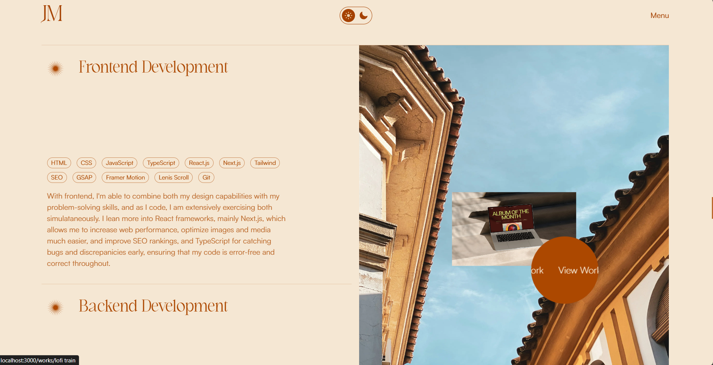
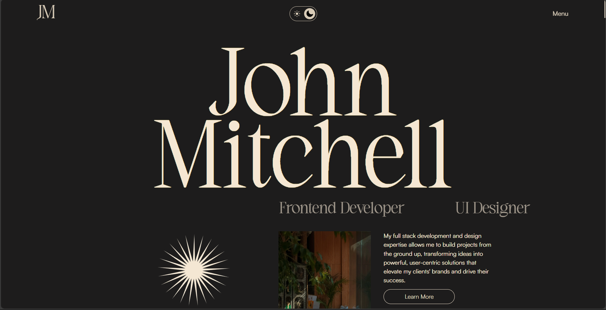

# Portfolio Template

Welcome to my open-source portfolio template! Feel free to make it your own by customizing it to suit your needs. This template is designed to be easy to modify and adapt, so don't hesitate to personalize it. If you find it useful, consider contributing or giving credit where applicable.

## 🚀 Features

- Responsive design for all devices
- Smooth animations and transitions
- Clean and modern user interface
- Easy-to-edit structure
- Integrated with [mention any specific frameworks or tools]
- [Add more features if needed]

## 🛠️ Tech Stack

This portfolio template is built using the following technologies:

- **Next.js**: Framework for server-side rendering and static site generation
- **GSAP**: Animation library for complex and performant animations
- **Framer Motion**: Animation library for React, used for declarative animations
- **Tailwind CSS**: Utility-first CSS framework for rapid UI development
- **JavaScript**: Dynamic content and interactivity

## 💻 Preview

You can see a live demo of the portfolio template in action here:

### Screenshot of the Portfolio(Light Mode):



### Screenshot of the Portfolio(Dark Mode):


[Live Demo](https://foliotemplate.vercel.app)

This will give you an idea of how the final portfolio looks and behaves, including the animations and responsiveness.

## 🛠️ Getting Started

To get started with this portfolio template, follow the steps below:

1. **Clone the Repository**  
   Clone this repository to your local machine:

   ```bash
   git clone https://github.com/rutaganda-salim/foliotemplate.git
   ```
2. **Install Dependencies**
   Navigate to the project directory and install the required dependencies:
   ```bash
   cd foliotemplate
   npm install
   ```
3. **Customize the Template**
   Customize the template to fit your needs. You can modify the content, colors, and styles to match your preferences.
4. **Run the Development Server**
   Start the development server to see your changes in real-time:
   ```bash
   npm run dev
   ```
   Open your browser and visit [http://localhost:3000](http://localhost:3000) to see your portfolio in action.
5. **Build and Deploy**
   Once you're satisfied with your changes, build the project and deploy it to your preferred hosting platform.

## 💡 Inspiration

I found inspiration for this portfolio design on [Awwwards](https://www.jasminemaduafokwa.com). The creative layouts and modern UI/UX practices helped shape the design of this project. You can check out the specific project that inspired me [here](https://www.jasminemaduafokwa.com).

## 🤝 Contributions

This project is open source! If you'd like to contribute, you can:

- Fork the repository
- Make your changes
- Submit a pull request

Feel free to report any bugs, suggest new features, or contribute directly.

## 📝 Credits

All credits go to the original creators of this portfolio Jasmine Maduafokwa.

## 🏷️ License

I don't really like this kind stuff of license , so you're free to modify and distribute it as long as you give proper credit.

---

Enjoy building your own personal portfolio!
